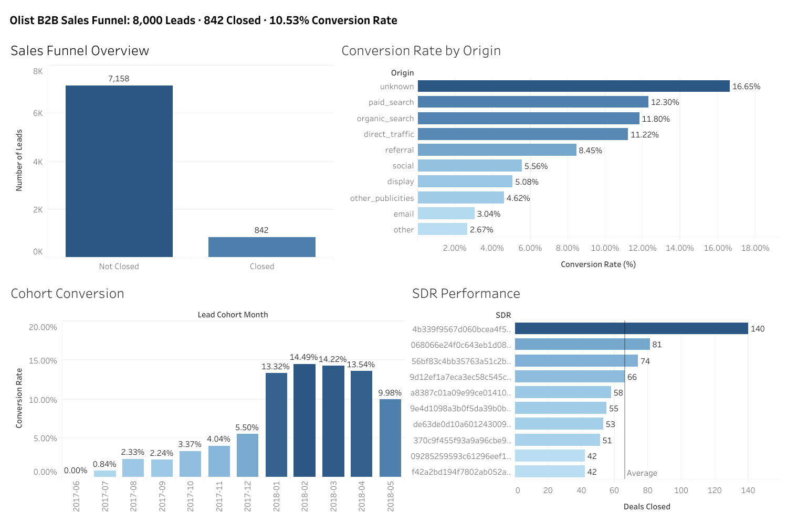

# From Lead to Seller: Olist B2B Sales Funnel Analysis

## Table of Contents
- [Business Context](#business-context)
- [Dataset Overview](#dataset-overview)
- [Entity Relationship Diagram](#entity-relationship-diagram)
- [Data Cleaning](#data-cleaning)
- [C. Funnel Overview](#c-funnel-overview)
- [D. Lead Source Analysis](#d-lead-source-analysis)
- [E. Sales Performance](#e-sales-performance)
- [Key Findings](#key-findings)

> Dataset sourced from: [Marketing Funnel by Olist on Kaggle](https://www.kaggle.com/datasets/olistbr/marketing-funnel-olist)

---

## Business Context

Olist is the largest department store in Brazilian marketplaces. Small businesses sell their products through the Olist Store and ship directly to customers using Olist's logistics partners. To onboard new sellers, Olist runs a structured B2B sales funnel:

1. A seller signs up on a landing page and becomes a Marketing Qualified Lead (MQL)
2. A Sales Development Representative (SDR) contacts them, confirms details, and schedules a consultancy
3. A Sales Representative (SR) conducts the consultancy and either closes or loses the deal
4. The closed lead becomes a seller, builds their catalog, and starts selling on Olist

This project analyzes 8,000 MQLs captured between June 2017 and June 2018 to answer: which channels bring the best leads, which seller profiles convert most, and how efficiently does the sales team close deals.

---

## Dashboard

[View Interactive Dashboard on Tableau Public](https://public.tableau.com/app/profile/rich.justine.gambe/viz/OlistB2BSalesFunnel/Dashboard1)



--- 

## Dataset Overview

| Table | Rows | Description |
|---|---|---|
| `marketing_qualified_leads` | 8,000 | Leads that requested contact, with source and first contact date |
| `closed_deals` | 842 | Leads that became sellers, with segment, profile, and revenue info |

Both tables join on `mql_id`. The `won_date` in `closed_deals` extends beyond the MQL capture window (up to Nov 2018) because leads take time to close after first contact.

---

## Entity Relationship Diagram


---

## Data Cleaning

> Before any analysis I inspected both tables in pgAdmin and used Excel filters for a quick categorical check. Several columns had nulls, dirty string values, and one typo. Four columns were excluded entirely due to 92%+ null rates. The cleaning is done via `TEMP TABLE`s so the cleaned data is reusable across all sections without repeating logic.

**Columns excluded from analysis:**

| Column | Null Rate | Reason |
|---|---|---|
| `has_company` | 92.5% | Insufficient data |
| `has_gtin` | 92.4% | Insufficient data |
| `average_stock` | 92.2% | Nulls + dirty entries (dates, numeric ranges) |
| `declared_product_catalog_size` | 91.8% | Insufficient data |

These columns are retained in the raw table but excluded from the cleaned temp tables.

**Cleaning decisions:**

```sql
-- MQL clean table
DROP TABLE IF EXISTS cleaned_marketing_qualified_leads;
CREATE TEMP TABLE cleaned_marketing_qualified_leads AS
SELECT
    mql_id,
    first_contact_date,
    landing_page_id,
    COALESCE(origin, 'unknown') AS origin
FROM olist_marketing.marketing_qualified_leads;

-- Closed deals clean table
DROP TABLE IF EXISTS cleaned_closed_deals;
CREATE TEMP TABLE cleaned_closed_deals AS
SELECT
    mql_id,
    seller_id,
    sdr_id,
    sr_id,
    won_date,
    REPLACE(COALESCE(business_segment, 'unknown'), 'jewerly', 'jewelry') AS business_segment,
    COALESCE(lead_type, 'unknown')              AS lead_type,
    COALESCE(lead_behaviour_profile, 'unknown') AS lead_behaviour_profile,
    COALESCE(business_type, 'unknown')          AS business_type,
    declared_monthly_revenue
FROM olist_marketing.closed_deals;
```

**Key cleaning decisions:**
- `origin` had 60 actual NULLs (confirmed via Excel, no empty strings), replaced with `'unknown'`
- `lead_behaviour_profile` had 177 NULLs, replaced with `'unknown'`
- `business_segment` had a `'jewerly'` typo, corrected to `'jewelry'` using `REPLACE` nested inside `COALESCE` so both the null and the typo are handled in one expression
- `declared_monthly_revenue` was clean. 94.5% of values are 0 (new sellers with no prior revenue), two extreme outliers (8M and 50M BRL) flagged but retained

**Date integrity check:**

```sql
SELECT COUNT(*) AS impossible_dates
FROM cleaned_closed_deals AS cd
JOIN cleaned_marketing_qualified_leads AS mql
    ON cd.mql_id = mql.mql_id
WHERE cd.won_date < mql.first_contact_date::TIMESTAMP;
```

Found 1 record where `won_date` is 2 days before `first_contact_date`, likely a data entry error. Retained in the dataset but excluded from all time-to-close calculations.

---

## C. Funnel Overview

> This section answers the most fundamental question: is the funnel healthy? The four metrics here (overall conversion, monthly lead volume, monthly deal volume, and conversion rate over time) are the standard building blocks of any B2B funnel analysis.

---

### C1. What is the overall conversion rate?

```sql
SELECT
    (SELECT COUNT(*) FROM cleaned_marketing_qualified_leads) AS total_leads,
    (SELECT COUNT(*) FROM cleaned_closed_deals)              AS total_closed,
    ROUND(
        (SELECT COUNT(*) FROM cleaned_closed_deals) * 100.0
        / (SELECT COUNT(*) FROM cleaned_marketing_qualified_leads)
    , 2) AS conversion_rate_pct;
```

**Approach:**
- No join needed here, just two independent counts from two separate tables
- `* 100.0` forces decimal division, avoids integer rounding to 0

**Result:**
| total_leads | total_closed | conversion_rate_pct |
|---|---|---|
| 8000 | 842 | 10.53% |

- Out of 8,000 leads, 842 became sellers. That is a 10.53% conversion rate.

---

### C2. How many MQLs came in per month?

```sql
SELECT
    TO_CHAR(DATE_TRUNC('month', first_contact_date), 'Mon YYYY') AS lead_month,
    COUNT(*) AS lead_count
FROM cleaned_marketing_qualified_leads
GROUP BY DATE_TRUNC('month', first_contact_date)
ORDER BY DATE_TRUNC('month', first_contact_date);
```

**Approach:**
- `DATE_TRUNC` is used in `GROUP BY` and `ORDER BY` for correct chronological sorting
- `TO_CHAR` is used only in `SELECT` for readable display. Grouping by the text version loses date ordering

**Result:**
| lead_month | lead_count |
|---|---|
| Jun 2017 | 4 |
| Jul 2017 | 239 |
| Aug 2017 | 386 |
| Sep 2017 | 312 |
| Oct 2017 | 416 |
| Nov 2017 | 445 |
| Dec 2017 | 200 |
| Jan 2018 | 1141 |
| Feb 2018 | 1028 |
| Mar 2018 | 1174 |
| Apr 2018 | 1352 |
| May 2018 | 1303 |

- June 2017 only has 4 leads because the dataset capture window starts June 1st
- There is a sharp jump from Dec 2017 (200) to Jan 2018 (1141), nearly 6x, suggesting a significant marketing push at the start of 2018

---

### C3. How many deals were closed per month?

```sql
SELECT
    TO_CHAR(DATE_TRUNC('month', won_date), 'Mon YYYY') AS won_month,
    COUNT(*) AS won_count
FROM cleaned_closed_deals
GROUP BY DATE_TRUNC('month', won_date)
ORDER BY DATE_TRUNC('month', won_date);
```

**Result:**
| won_month | won_count |
|---|---|
| Dec 2017 | 3 |
| Jan 2018 | 73 |
| Feb 2018 | 113 |
| Mar 2018 | 147 |
| Apr 2018 | 207 |
| May 2018 | 122 |
| Jun 2018 | 57 |
| Jul 2018 | 37 |
| Aug 2018 | 33 |
| Sep 2018 | 23 |
| Oct 2018 | 21 |
| Nov 2018 | 6 |

- Closings extend to November 2018 even though MQL capture ends June 2018, confirming the funnel lag where leads take weeks or months to close
- Peak closings in April 2018 (207), followed by a sharp decline, likely reflecting the earlier lead surge in Jan-Mar 2018 working through the pipeline

---

### C4. Conversion rate over time: same-month vs cohort

Two approaches are shown here because they answer different questions. Same-month compares leads and deals in the same calendar month. Cohort tracks each month's leads to eventual close regardless of when that close happened.

```sql
-- C4c. Combined: same-month vs cohort side by side
WITH monthly_leads AS (
    SELECT
        DATE_TRUNC('month', first_contact_date) AS lead_month,
        COUNT(*) AS lead_count
    FROM cleaned_marketing_qualified_leads
    GROUP BY DATE_TRUNC('month', first_contact_date)
),
monthly_deals AS (
    SELECT
        DATE_TRUNC('month', won_date) AS won_month,
        COUNT(*) AS won_count
    FROM cleaned_closed_deals
    GROUP BY DATE_TRUNC('month', won_date)
),
cohort AS (
    SELECT
        DATE_TRUNC('month', mql.first_contact_date) AS cohort_month,
        COUNT(cd.mql_id) AS converted
    FROM cleaned_marketing_qualified_leads AS mql
    LEFT JOIN cleaned_closed_deals AS cd ON mql.mql_id = cd.mql_id
    GROUP BY DATE_TRUNC('month', mql.first_contact_date)
)
SELECT
    TO_CHAR(ml.lead_month, 'Mon YYYY')                           AS month,
    ml.lead_count                                                AS total_leads,
    COALESCE(md.won_count, 0)                                    AS same_month_closed,
    ROUND(COALESCE(md.won_count, 0) * 100.0 / ml.lead_count, 2) AS same_month_pct,
    co.converted                                                 AS cohort_closed,
    ROUND(co.converted * 100.0 / ml.lead_count, 2)              AS cohort_pct
FROM monthly_leads AS ml
LEFT JOIN monthly_deals AS md ON ml.lead_month = md.won_month
LEFT JOIN cohort AS co        ON ml.lead_month = co.cohort_month
ORDER BY ml.lead_month;
```

**Approach:**
- Three CTEs are chained: `monthly_leads` and `monthly_deals` for same-month, `cohort` for the cohort rate
- `COALESCE(md.won_count, 0)` handles months where no deals closed that same month
- The cohort CTE joins on `mql_id` not on matching months. This is the key difference that makes it cohort-based

**Result:**
| month | total_leads | same_month_closed | same_month_pct | cohort_closed | cohort_pct |
|---|---|---|---|---|---|
| Jun 2017 | 4 | 0 | 0.00% | 0 | 0.00% |
| Jul 2017 | 239 | 0 | 0.00% | 2 | 0.84% |
| Aug 2017 | 386 | 0 | 0.00% | 9 | 2.33% |
| Sep 2017 | 312 | 0 | 0.00% | 7 | 2.24% |
| Oct 2017 | 416 | 0 | 0.00% | 14 | 3.37% |
| Nov 2017 | 445 | 0 | 0.00% | 18 | 4.04% |
| Dec 2017 | 200 | 3 | 1.50% | 11 | 5.50% |
| Jan 2018 | 1141 | 73 | 6.40% | 152 | 13.32% |
| Feb 2018 | 1028 | 113 | 10.99% | 149 | 14.49% |
| Mar 2018 | 1174 | 147 | 12.52% | 167 | 14.22% |
| Apr 2018 | 1352 | 207 | 15.31% | 183 | 13.54% |
| May 2018 | 1303 | 122 | 9.36% | 130 | 9.98% |

- Early cohorts (Jul-Nov 2017) look like 0% same-month but cohort reveals they did convert, just slowly, with longer sales cycles in the early funnel stage
- Feb and Mar 2018 have the strongest cohort conversion at 14%+, those leads converted at a high rate eventually
- Apr 2018 leads same-month (15.31%) but ranks 3rd in cohort, some of those leads had not yet closed by the time the dataset ends

---

## D. Lead Source Analysis

> This section answers: which channels bring the most leads, and which bring the best quality leads? Note that `business_segment`, `lead_type`, and `lead_behaviour_profile` only exist in `closed_deals`, not in MQL. True conversion rates cannot be calculated for those dimensions, only distribution among converted sellers.

---

### D1. How many MQLs came from each origin?

```sql
SELECT
    origin,
    COUNT(*) AS total_leads
FROM cleaned_marketing_qualified_leads
GROUP BY origin
ORDER BY total_leads DESC;
```

**Result:**
| origin | total_leads |
|---|---|
| organic_search | 2296 |
| paid_search | 1586 |
| social | 1350 |
| unknown | 1159 |
| direct_traffic | 499 |
| email | 493 |
| referral | 284 |
| other | 150 |
| display | 118 |
| other_publicities | 65 |

- Organic search is the dominant channel at 28.7% of all leads
- Unknown source accounts for 14.5%, a significant attribution gap that makes channel analysis incomplete

---

### D2. What is the conversion rate by origin?

```sql
SELECT
    mql.origin,
    COUNT(mql.mql_id)                                       AS total_leads,
    COUNT(cd.mql_id)                                        AS converted,
    ROUND(COUNT(cd.mql_id) * 100.0 / COUNT(mql.mql_id), 2) AS conversion_rate_pct
FROM cleaned_marketing_qualified_leads AS mql
LEFT JOIN cleaned_closed_deals AS cd ON mql.mql_id = cd.mql_id
GROUP BY mql.origin
ORDER BY conversion_rate_pct DESC;
```

**Approach:**
- `COUNT(cd.mql_id)` counts only rows where a match exists in `closed_deals` (converted leads)
- `COUNT(mql.mql_id)` counts all leads regardless of conversion
- The `LEFT JOIN` is essential. An `INNER JOIN` would drop unconverted leads and make every origin show 100%

**Result:**
| origin | total_leads | converted | conversion_rate_pct |
|---|---|---|---|
| unknown | 1159 | 193 | 16.65% |
| paid_search | 1586 | 195 | 12.30% |
| organic_search | 2296 | 271 | 11.80% |
| direct_traffic | 499 | 56 | 11.22% |
| referral | 284 | 24 | 8.45% |
| social | 1350 | 75 | 5.56% |
| display | 118 | 6 | 5.08% |
| other_publicities | 65 | 3 | 4.62% |
| email | 493 | 15 | 3.04% |
| other | 150 | 4 | 2.67% |

- Unknown origin converts best at 16.65%, the highest quality leads have no source attribution, which is a tracking problem worth fixing
- Paid search (12.30%) outperforms organic (11.80%) in quality despite lower volume
- Email converts at only 3.04% despite being the 5th largest channel by volume
- Social brings high volume (3rd) but below-average conversion (5.56%)

---

### D3. Which business segment has the most closed deals?

```sql
SELECT
    business_segment,
    COUNT(*) AS total_closed,
    ROUND(COUNT(*) * 100.0 / (SELECT COUNT(*) FROM cleaned_closed_deals), 2) AS pct_of_total
FROM cleaned_closed_deals
GROUP BY business_segment
ORDER BY total_closed DESC;
```

**Result (top 10):**
| business_segment | total_closed | pct_of_total |
|---|---|---|
| home_decor | 105 | 12.47% |
| health_beauty | 93 | 11.05% |
| car_accessories | 77 | 9.14% |
| household_utilities | 71 | 8.43% |
| construction_tools_house_garden | 69 | 8.19% |
| audio_video_electronics | 64 | 7.60% |
| computers | 34 | 4.04% |
| pet | 30 | 3.56% |
| food_supplement | 28 | 3.33% |
| food_drink | 26 | 3.09% |

- The top 6 segments account for ~57% of all closed deals, acquisition is heavily concentrated in home and lifestyle categories
- Home decor alone represents 1 in 8 closed deals

---

### D4. What is the distribution of lead types among closed deals?

```sql
SELECT
    lead_type,
    COUNT(*) AS total_closed,
    ROUND(COUNT(*) * 100.0 / (SELECT COUNT(*) FROM cleaned_closed_deals), 2) AS pct_of_total
FROM cleaned_closed_deals
GROUP BY lead_type
ORDER BY total_closed DESC;
```

**Result:**
| lead_type | total_closed | pct_of_total |
|---|---|---|
| online_medium | 332 | 39.43% |
| online_big | 126 | 14.96% |
| industry | 123 | 14.61% |
| offline | 104 | 12.35% |
| online_small | 77 | 9.14% |
| online_beginner | 57 | 6.77% |
| online_top | 14 | 1.66% |

- Online sellers across all sizes account for ~72% of closed deals
- Online medium is the core target at 39.43%, nearly 4 in 10 closed deals
- The largest online sellers (online_top) are the rarest at 1.66%, likely harder to acquire or less interested in the platform

---

### D5. What behaviour profile is most common among closed deals?

```sql
SELECT
    lead_behaviour_profile,
    COUNT(*) AS total_closed,
    ROUND(COUNT(*) * 100.0 / (SELECT COUNT(*) FROM cleaned_closed_deals), 2) AS pct_of_total
FROM cleaned_closed_deals
GROUP BY lead_behaviour_profile
ORDER BY total_closed DESC;
```

**Result:**
| lead_behaviour_profile | total_closed | pct_of_total |
|---|---|---|
| cat | 407 | 48.34% |
| unknown | 177 | 21.02% |
| eagle | 123 | 14.61% |
| wolf | 95 | 11.28% |
| shark | 24 | 2.85% |
| cat, wolf | 8 | 0.95% |

- Cat profile dominates at 48% of all closed deals
- Shark profile is the rarest at 2.85% among converted sellers
- 21% unknown profile, the tracking gap here limits the reliability of this analysis
- Note: profile labels are defined by Olist's internal sales methodology. The dataset documentation does not provide explicit definitions for each profile, so interpretation based on animal characteristics would be speculative

---

## E. Sales Performance

> This section answers: how long does it take to close a deal, and who closes the most? A temp table (`sales_performance`) is created upfront with `days_to_close` pre-calculated so all E queries can use it directly without repeating the join logic.

```sql
DROP TABLE IF EXISTS sales_performance;
CREATE TEMP TABLE sales_performance AS
SELECT
    cd.mql_id,
    cd.seller_id,
    cd.sdr_id,
    cd.sr_id,
    cd.business_segment,
    cd.lead_type,
    cd.lead_behaviour_profile,
    cd.business_type,
    cd.declared_monthly_revenue,
    mql.origin,
    mql.first_contact_date,
    cd.won_date,
    (cd.won_date::DATE - mql.first_contact_date) AS days_to_close
FROM cleaned_closed_deals AS cd
LEFT JOIN cleaned_marketing_qualified_leads AS mql
    ON cd.mql_id = mql.mql_id
WHERE cd.won_date >= mql.first_contact_date::TIMESTAMP;
```

Returns 841 rows, 842 closed deals minus the 1 excluded impossible date record.

---

### E1. What is the average time from first contact to closing?

```sql
SELECT ROUND(AVG(days_to_close), 2) AS avg_days_to_close
FROM sales_performance;
```

**Result:**
| avg_days_to_close |
|---|
| 48.50 |

- On average it takes 48.5 days (~6.5 weeks) from first contact to a closed deal

---

### E2. Which business segment closes fastest?

```sql
SELECT
    business_segment,
    COUNT(*) AS total_closed,
    ROUND(AVG(days_to_close), 2) AS avg_days_to_close
FROM sales_performance
GROUP BY business_segment
HAVING COUNT(*) >= 5
ORDER BY avg_days_to_close ASC;
```

**Approach:**
- `HAVING COUNT(*) >= 5` filters out segments with too few deals to be statistically reliable

**Result (top 10 fastest):**
| business_segment | total_closed | avg_days_to_close |
|---|---|---|
| bags_backpacks | 22 | 19.59 |
| home_office_furniture | 14 | 21.71 |
| sports_leisure | 25 | 26.76 |
| pet | 30 | 29.13 |
| phone_mobile | 13 | 29.46 |
| food_drink | 26 | 31.58 |
| health_beauty | 92 | 35.46 |
| stationery | 13 | 36.46 |
| food_supplement | 28 | 38.32 |
| books | 9 | 42.22 |

- Bags & backpacks closes fastest at under 20 days
- Health & beauty is the fastest among high-volume segments at 35.46 days with 92 deals
- Audio/video electronics (63.23 days) and toys (64.25 days) are the slowest, likely more complex seller onboarding

---

### E3. Which origin closes fastest?

```sql
SELECT
    origin,
    COUNT(*) AS total_closed,
    ROUND(AVG(days_to_close), 2) AS avg_days_to_close
FROM sales_performance
GROUP BY origin
HAVING COUNT(*) >= 5
ORDER BY avg_days_to_close ASC;
```

**Result:**
| origin | total_closed | avg_days_to_close |
|---|---|---|
| display | 6 | 10.33 |
| direct_traffic | 56 | 31.13 |
| referral | 24 | 32.54 |
| unknown | 193 | 41.87 |
| organic_search | 270 | 50.19 |
| email | 15 | 52.20 |
| paid_search | 195 | 56.60 |
| social | 75 | 60.96 |

Cross-referencing with D2 conversion rates:

| origin | conversion_rate | avg_days_to_close |
|---|---|---|
| direct_traffic | 11.22% | 31.13 days |
| paid_search | 12.30% | 56.60 days |
| organic_search | 11.80% | 50.19 days |
| social | 5.56% | 60.96 days |

- Direct traffic has good conversion (11.22%) AND closes fast (31 days), best overall channel quality
- Paid search converts well but takes nearly 2x longer than direct traffic to close
- Social has the worst combination, low conversion and slowest close time

---

### E4. Top performing SDRs by deals closed

SDR (Sales Development Representative) is the first human contact after a lead signs up. Their job is to confirm details and schedule a consultancy with the SR.

```sql
SELECT
    sdr_id,
    COUNT(*) AS total_closed,
    ROUND(AVG(days_to_close), 2) AS avg_days_to_close
FROM sales_performance
GROUP BY sdr_id
ORDER BY total_closed DESC
LIMIT 10;
```

**Result:**
| sdr_id | total_closed | avg_days_to_close |
|---|---|---|
| 4b339f...| 140 | 33.59 |
| 068066...| 81 | 31.22 |
| 56bf83...| 74 | 27.14 |
| 9d12ef...| 66 | 45.50 |
| a8387c...| 58 | 26.02 |
| 9e4d10...| 55 | 18.29 |
| de63de...| 53 | 33.04 |
| 370c9f...| 51 | 50.78 |
| f42a2b...| 42 | 78.33 |
| 09285...| 42 | 36.67 |

- Top SDR closed 140 deals, 73% more than 2nd place (81)
- SDR 9e4d has best efficiency with 55 deals at only 18.29 avg days
- SDR f42a has the slowest close time at 78.33 days despite 42 deals, worth investigating
- All IDs anonymized per Olist data privacy policy

---

### E5. Top performing SRs by deals closed

SR (Sales Representative) conducts the consultancy and is responsible for closing the deal.

```sql
SELECT
    sr_id,
    COUNT(*) AS total_closed,
    ROUND(AVG(days_to_close), 2) AS avg_days_to_close
FROM sales_performance
GROUP BY sr_id
ORDER BY total_closed DESC
LIMIT 10;
```

**Result:**
| sr_id | total_closed | avg_days_to_close |
|---|---|---|
| 4ef15a...| 133 | 30.49 |
| d3d1e9...| 82 | 46.65 |
| 6565aa...| 74 | 25.78 |
| 85fc44...| 64 | 33.70 |
| 495d4e...| 62 | 49.40 |
| 2695de...| 59 | 48.39 |
| fbf4ae...| 59 | 21.97 |
| de63de...| 53 | 61.74 |
| 9ae085...| 51 | 41.71 |
| c63811...| 36 | 22.39 |

- Top SR closed 133 deals, 62% more than 2nd place (82)
- SR fbf4 has best efficiency with 59 deals at 21.97 avg days
- SR de63 appears in both SDR and SR top 10, same person filling dual roles
- All IDs anonymized per Olist data privacy policy

---

## Key Findings

The funnel converts at 10.53% overall, meaning roughly 1 in 10 leads becomes a seller on Olist. Most of the lead volume arrived in early 2018, with April being the peak month at 1,352 MQLs. When you look at cohort data though, the Feb and Mar 2018 leads actually converted better in the long run at 14%+, while April's strong same-month number is partly because some of those leads hadn't closed yet by the time the dataset ends.

On channels, the most interesting finding is that direct traffic quietly outperforms everything else. It converts at 11.22% and closes in 31 days on average. Paid search converts slightly better at 12.30% but takes nearly twice as long to close. Social brings a lot of leads but underperforms badly on both metrics. And then there is the unknown origin group sitting at 16.65% conversion with no attribution at all, which means the best-performing channel cannot even be identified. Fixing that tracking gap would be the first thing worth addressing.

For seller profiles, home decor, health & beauty, and car accessories dominate, making up about a third of all closed deals between them. Online medium-sized sellers are the typical acquisition target at 39% of closed deals. The cat behaviour profile accounts for nearly half of all converted sellers, though the dataset does not define what that profile actually means in practice.

The sales team closes deals in 48.5 days on average. The top SDR closed 140 deals, which is 73% more than the second-ranked SDR, and one person (SR de63) appears in both the SDR and SR top 10 lists, suggesting they are handling dual responsibilities. SDR f42a's 78-day average close time stands out against peers and is worth a closer look.

---

*Built with PostgreSQL 18 + pgAdmin 4*
